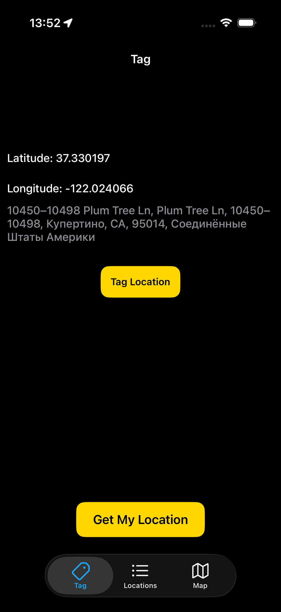
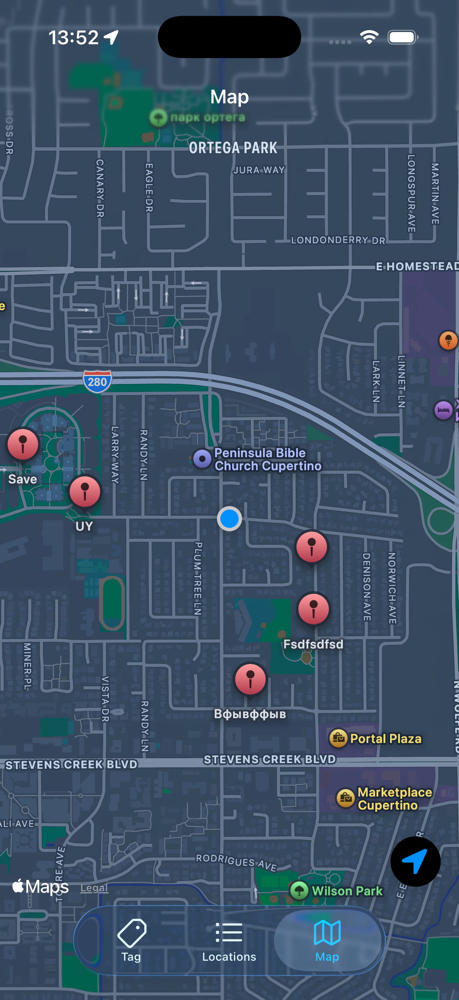
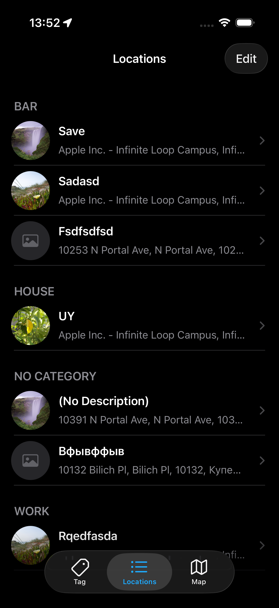

📍 MyLocations

iOS-приложение для сохранения и управления пользовательскими локациями с использованием локальной персистентности.

Проект демонстрирует чистую архитектуру, модульную сборку и надёжное хранение данных через Core Data.

## 📱 Screenshots

 ✨ Функциональность

### 📌 Current Location
- Получение текущих координат через CoreLocation
- Reverse Geocoding (определение города)
- Обработка разрешений на доступ к геолокации
- State-driven UI (управление интерфейсом через состояния)

### 🏷 Tag Location
- Создание новой локации
- Ввод пользовательского названия
- Выбор категории
- Сохранение с отметкой времени

### ✏️ Edit Location
- Редактирование существующей локации
- Обновление категории
- Обновление описания
- Замена фотографии
- Синхронизация изменений через Core Data
- Обновление списка и карты после сохранения

### 📋 Locations List
- Отображение сохранённых локаций
- Сортировка по дате создания (новые сверху)
- Пустое состояние (Empty State)
- Swipe-to-delete
- Удаление с сохранением изменений в Core Data
- Данные сохраняются после перезапуска приложения

### 🗺 Map
- Отображение всех сохранённых локаций на карте (MapKit)
- Кастомные аннотации с Callout
- Открытие редактора по нажатию на Callout
- Отображение текущего местоположения пользователя
- Центрирование на пользователе (Locate Me)
- Автоматическое обновление пинов после редактирования

### 📷 Photo Handling
- Добавление фотографии к локации
- Сохранение имени файла в Core Data
- Отображение изображения в списке и редакторе
- Поддержка отсутствия изображения (placeholder)
⸻

## 💾 Персистентность

- Core Data как слой хранения
- Абстракция через `LocationsStoreProtocol`
- Разделение доменной модели (`LocationItem`) и `NSManagedObject`
- Реализация CRUD:
  - Create
  - Read
  - Update
  - Delete
- Обновление UI после изменений данных

## 🧱 Архитектура

Приложение построено по принципам MVP (Model–View–Presenter).

### Ключевые решения:
- Чёткое разделение UI и бизнес-логики
- Абстракция слоя хранения через LocationsStoreProtocol
- Разделение доменной модели и модели хранения
- Сборка модулей через Assembly
- Управление состояниями через state-machine

## 🧠 Архитектурные принципы

- Чистая модульная сборка (Assembly)
- Протокол-ориентированный подход
- Dependency Injection
- Weak references для предотвращения retain cycle
- Разделение ответственности (Single Responsibility)
- State-machine для управления UI
- Отсутствие Storyboard — полностью программная верстка
    
## 🛠 Использованные технологии
- Swift
- UIKit
- CoreLocation
- Core Data
- MVP Architecture
- Dependency Injection
- State-driven UI
- Git
    
    
    
